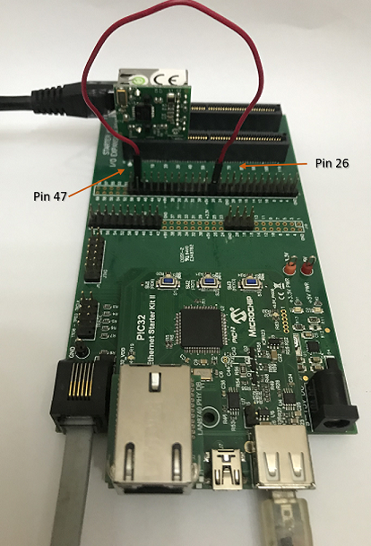
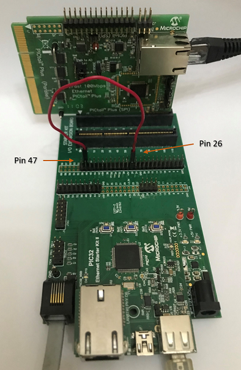

# TCP/IP TCP Client Hardware Configuration

This is the following section describes the hardware configurations and one of the configuration can be used for this application demonstration.

1. This section describes the PIC32MX device default hardware configuration use USB device as **on board debugger and programmer** for this application demonstration.

    * Refer to the PIC32MX Ethernet Starter Kit [User Guide](https://www.microchip.com/DevelopmentTools/ProductDetails/dm320004-2)

		

	* No hardware related configuration or jumper setting changes are necessary.
	
	* Connect the mini USB cable from the computer to the USB DEBUG connector on the PIC32MX Ethernet Starter Kit
		
	* Establish a connection between the router/switch with the PIC32MX Ethernet Starter Kit through the RJ45 connector on PHY daughter board
	
	* Note: The PIC32MX Ethernet Starter Kit II does not have an on-board UART connector.
		* If a serial console is needed, a quick workaround may be attaching the Starter Kit to an Explorer 16 Development Board by using a Starter Kit I/O Expansion Board.
		* Alternatively, a telnet session could be used for console message and TCP/IP command execution.
	
2. This section describes PIC32MX device hardware configuration for **external Ethernet controller ENC28J60** with PIC32MX5XX/6XX/7XX
development board.

    * Refer to the ENC28j60 External Ethernet PICtail Plus Daughter Board [User Guide][https://www.microchip.com/developmenttools/ProductDetails/AC164123]

	* Refer to Starter Kit I/O Expansion Board [User Guide][https://www.microchip.com/developmenttools/ProductDetails/DM320002]

	  The 10Mbps Ethernet PICtail Plus Daughter Board is inserted to J2(or J4) on the Starter Kit I/O Expansion Board. The J2, PICtail Plus (SPI) connector on Ethernet PICtail Plus Daughter Board is attached to I/O Expansion Board. The PICtail daughter board is inserted to use SPI1.

	  The PIC32 Ethernet Starter Kit II is connected to J1 on the Starter Kit I/O Expansion board.

	  The pins 26 and 47 on J11 (on I/O Expansion board) need to be connected to control the Chip-Select line by the PIC32.
	  Note: The PIC32MX Ethernet Starter Kit II does not have an on-board UART connector.
	  If a serial console is needed, Pin 46 (U2RX) and Pin 48 (U2TX) from connector J11 on I/O expansion board can be used for serial console.

	  

3. This section describes PIC32MX device hardware configuration for **external Ethernet controller ENC624J600** with PIC32MX5XX/6XX/7XX development board.

    * Refer to the ENCX24j600 External Ethernet PICtail Plus Daughter Board [User Guide][https://www.microchip.com/developmenttools/ProductDetails/AC164132]

	* Refer to Starter Kit I/O Expansion Board [User Guide][https://www.microchip.com/developmenttools/ProductDetails/DM320002]

	  The Fast 100Mbps Ethernet PICtail Plus Daughter Board is inserted to J2(or J4) on the Starter Kit I/O Expansion Board. The J2, PICtail Plus (SPI) connector on Fast 100Mbps Ethernet PICtail Plus Daughter Board is attached to I/O Expansion Board with white arrows on the two boards lined up. The PICtail daughter board is inserted to use SPI1.

	  The PIC32 Ethernet Starter Kit II is connected to J1 on the Starter Kit I/O Expansion board.

	  The pins 26 and 47 on J11 (on I/O Expansion board) need to be connected to control the Chip-Select line by the PIC32.

	  **Note:** The PIC32MX Ethernet Starter Kit II does not have an on-board UART connector. If a serial console is needed, Pin 46 (U2RX) and Pin 48 (U2TX) from connector J11 on I/O expansion board can be used for serial console.

	  