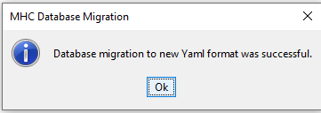
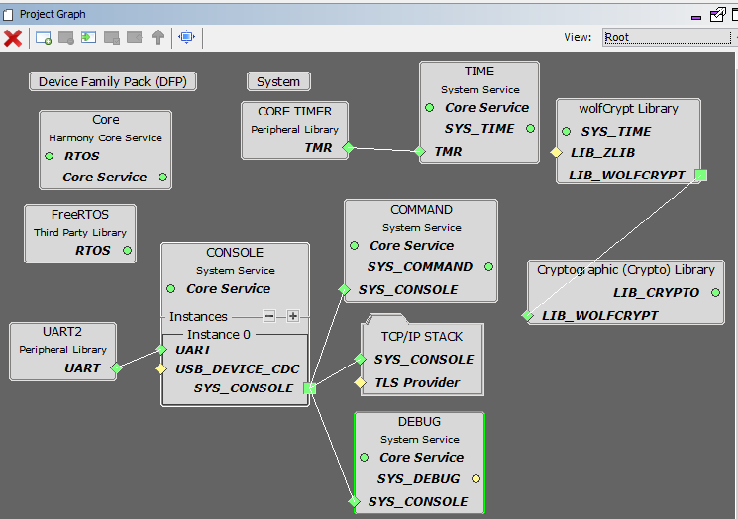
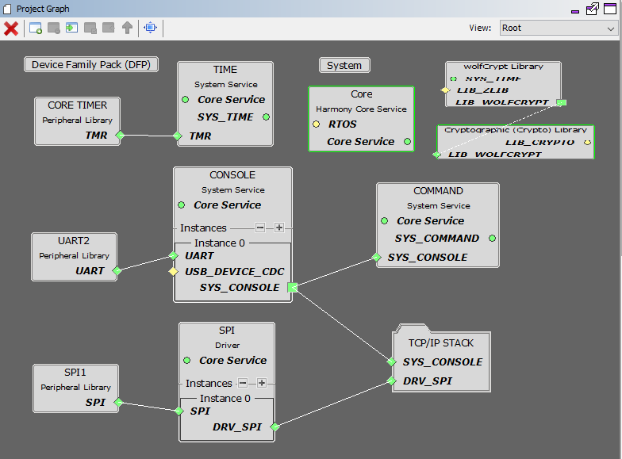
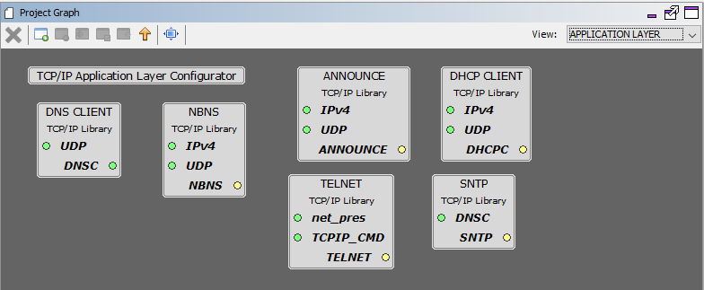
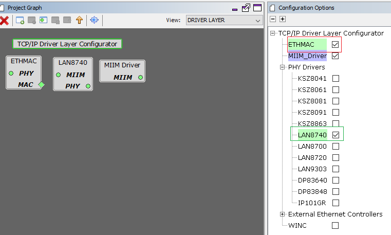
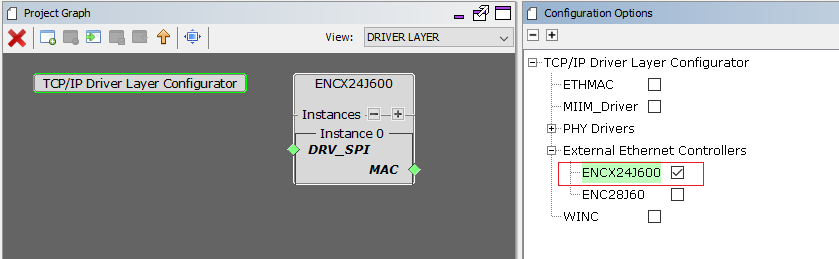
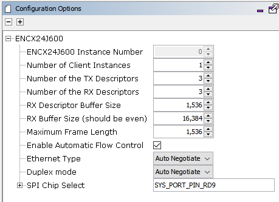

# TCP/IP TCP Client MHC Configuration

The following Project Graph diagram shows the Harmony components included in the TCP Client demonstration application.

* MHC is launched by selecting **Tools > Embedded > MPLAB® Harmony 3 Configurator** from the MPLAB X IDE and after successful database migration , TCP/IP demo project is ready to be configured and regenerated.

    

* **TCP/IP Root Layer Project Graph**

    1. TCP/IP stack module with **internal ethmac**

        The root layer project shows that UART2 peripheral is selected to do read and write operation for TCP/IP commands.

        This is the basic configuration with SYS_CONSOLE, SYS_DEBUG and SYS_COMMAND modules. These modules are required for TCP/IP command execution.

        

         TCP sockets calculate the ISN using the **wolfSSL crypto library**.

         **FreeRTOS** component is required for the Freertos demo.

         **TCPIP Ethernet Priority** should be lower compared to Freertos module priority number. PIC32Mx low the priority number = low priority.

    2. TCP/IP stack module with **external mac daughter board**

         Both ENC28j60 and ENCX24j600 daughter board use SPI1 driver and peripheral to communicate with the PIC32MZ EF controller. -

         

         TCP sockets calculate the ISN using the wolfSSL crypto library.

* **TCP/IP Application Layer**

  TCP/IP demo use these application module components for this demo.

	**Telnet** connection can be used for various system and TCP/IP related commands, just as the regular system console is used.

	The **NetBIOS Name Service(NBNS)** protocol associates host names with IP addresses.

	**SNTP** module updates its internal time periodically using a public global time server. The system timer module provides much better accuracy (since it is driven by a hardware clock) and resolution, and should be used for measuring timeouts and other internal requirements.

	The commands currently implemented and processed by the command processor can be dynamically updated, new commands can be added, etc. See the tcpip_commands.c file for the list of TCP/IP-related commands.

	

	**Announce** module to discover the Microchip devices within a local network.

	**DHCP Client** module to discover the IPv4 address from the nearest DHCP Server.

	**DNS Client** provides DNS resolution capabilities to the stack.

* **TCPIP Driver Layer**

    1. **Internal ethernet driver(ethmac)**

          **Internal ethernet driver(ethmac)** is enabled with the external **LAN8740 PHY driver** library. The MIIM Driver supports asynchronous read/write and scan operations for accessing the external PHY registers and notification when MIIM operations have completed.

          

    2. **External ENC28j60 ethernet driver**

        TCP/IP ENC28j60 driver module selected for the external ethernet  mac ENC28j60 device. For high MAC TX and RX performance DRV_ENC28j60_MAC_TX_DESCRIPTORS and DRV_ENC28j60_MAC_RX_DESCRIPTORS can be configured respectively more than the default descriptor value size "2".
        

        

    3. **External ENCX24j600 ethernet driver**

        TCP/IP ENCx24j600 driver module selected for the external ethernet  mac ENC28j60 device. For high MAC TX and RX performance DRV_ENCX24j600_MAC_TX_DESCRIPTORS and DRV_ENCX24j600_MAC_RX_DESCRIPTORS can be configured respectively more than the default descriptor value size "2".

        

        
