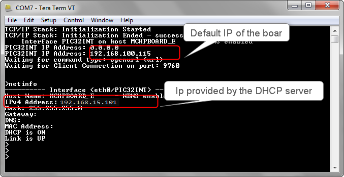
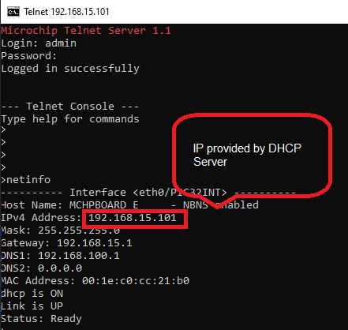

# TCP/IP TCP Client Running Application

## MPLAB X IDE Project
This table list the name and location of the MPLAB X IDE project folder for the demonstration.

|Project Name|  Target Device|  Target Development Board | Description  |
|:-------------:|:---------:|:---------:|:---------:|
|pic32mx_eth_sk2.X | PIC32MX795F512L | PIC32MX Ethernet Starter Kit II | Demonstrates the TCP/IP TCP Client on development board with PIC32MX795F512L device and LAN8740 PHY daughter board. This is a bare-metal (non-RTOS) implementation.  |
|pic32mx_eth_sk2_freertos.X | PIC32MX795F512L | PIC32MX Ethernet Starter Kit II | Demonstrates the TCP/IP TCP Client on development board with PIC32MX795F512L device and LAN8740 PHY daughter board. This is a **FreeRtos** implementation.  |
|pic32mx_eth_sk2_enc28j60.X | PIC32MX795F512L | PIC32MX Starter Kit II + External Ethernet Pictail Controller  ENC28j60 + I/O Expansion Board  | Demonstrates the TCP/IP TCP Client on development board with PIC32MX795F512L device and external Ethernet controller ENC28J60. This is a bare-metal (non-RTOS) implementation  |
|pic32mx_eth_sk2_encx24j600.X | PIC32MX795F512L | PIC32MX Starter Kit II + External Ethernet Pictail Controller  ENCx24j600 + I/O Expansion Board  | Demonstrates the TCP/IP TCP Client on development board with PIC32MX795F512L device and external Ethernet controller ENCx24j600. This is a bare-metal (non-RTOS) implementation  |

## Running The Demonstration

1. Configure the Development Board as given  **[Configure Hardware](readme_hardware_configuration.md)**.

2. Make the demonstration setup as shown [Network Setup](../../readme.md).

3. Build and download the demonstration project on the target board.

4. If the board has a UART connection:

    1. A virtual COM port will be detected on the computer, when the USB cable is connected to USB-UART connector.

    2. Open a standard terminal application on the computer (like Hyper-terminal or Tera Term) and configure the virtual COM port.

    3. Set the serial baud rate to 115200 baud in the terminal application.

    4. See that the initialization prints on the serial port terminal.

    5. When the DHCP client is enabled in the demonstration, wait for the DHCP server to assign an IP address for the development board. This will be printed on the serial port terminal.

		* Alternatively: Use the Announce service or ping to get the IP address of the board.

        * Run **tcpip_discoverer.jar** to discover the IPv4 and IPv6 address for the board.

5. Execution :

    1. Open the Telnet or UART2 session to get the console output. After the successful broad bring up, the console output for telnet session provides the output. The below diagram shows the UART console output.

        UART2 Output -

        

        Telnet Output -

        

    2. For TCP Client test, input the following command from the serial port:
	Open the telnet session with the board IP address

        **openurl < url >** - The < url > argument must be a fully formed URL; for instance, http://www.microchip.com/.

        For this above URL , the DNS module will make a DNS query. Then it will open a connection to the requested URL and perform a simple HTTP GET command.

        The response received from the server will be printed on the terminal application through the serial port.

        The expected output -

        
