# TCP/IP TCP Client Applications

The TCP Client configuration demonstrates creating a network client with the MPLAB Harmony TCP API to make a TCP/IP connection to a web server.

**TCP/IP TCP Client MHC Configuration**

The following Project Graph diagram shows the Harmony components included in the TCP Client demonstration application.

-   MHC is launched by selecting **Tools \> Embedded \> MPLAB® Harmony 3 Configurator** from the MPLAB X IDE and after successful database migration , TCP/IP demo project is ready to be configured and regenerated.

    

-   **TCP/IP Root Layer Project Graph**

    1.  TCP/IP stack module with **internal ethmac**

        The root layer project shows that UART2 peripheral is selected to do read and write operation for TCP/IP commands.

        This is the basic configuration with SYS\_CONSOLE, SYS\_DEBUG and SYS\_COMMAND modules. These modules are required for TCP/IP command execution.

        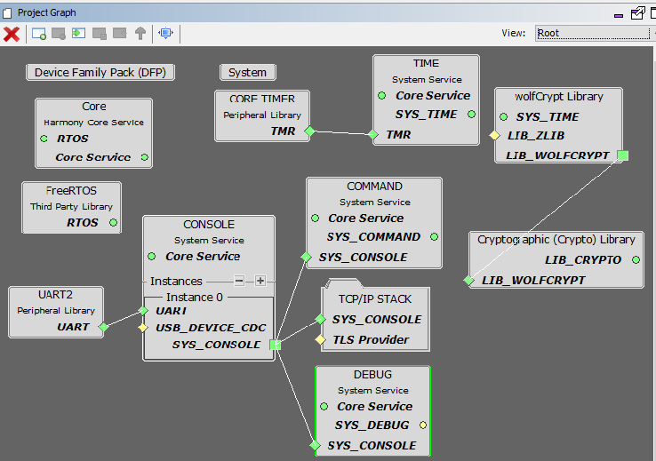

        TCP sockets calculate the ISN using the **wolfSSL crypto library**.

        **FreeRTOS** component is required for the Freertos demo.

        **TCPIP Ethernet Priority** should be lower compared to Freertos module priority number. PIC32Mx low the priority number = low priority.

    2.  TCP/IP stack module with **external mac daughter board**

        Both ENC28j60 and ENCX24j600 daughter board use SPI1 driver and peripheral to communicate with the PIC32MZ EF controller. -

        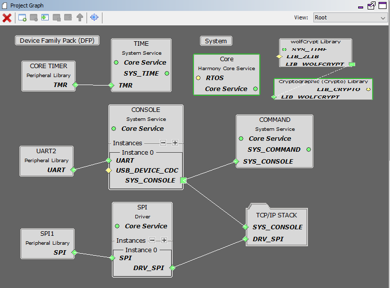

        TCP sockets calculate the ISN using the wolfSSL crypto library.

-   **TCP/IP Application Layer**

    TCP/IP demo use these application module components for this demo.

    **Telnet** connection can be used for various system and TCP/IP related commands, just as the regular system console is used.

    The **NetBIOS Name Service\(NBNS\)** protocol associates host names with IP addresses.

    **SNTP** module updates its internal time periodically using a public global time server. The system timer module provides much better accuracy \(since it is driven by a hardware clock\) and resolution, and should be used for measuring timeouts and other internal requirements.

    The commands currently implemented and processed by the command processor can be dynamically updated, new commands can be added, etc. See the tcpip\_commands.c file for the list of TCP/IP-related commands.

    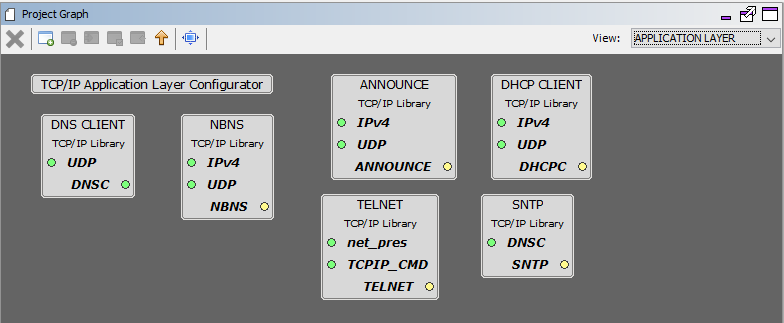

    **Announce** module to discover the Microchip devices within a local network.

    **DHCP Client** module to discover the IPv4 address from the nearest DHCP Server.

    **DNS Client** provides DNS resolution capabilities to the stack.

-   **TCPIP Driver Layer**

    1.  **Internal ethernet driver\(ethmac\)**

        **Internal ethernet driver\(ethmac\)** is enabled with the external **LAN8740 PHY driver** library. The MIIM Driver supports asynchronous read/write and scan operations for accessing the external PHY registers and notification when MIIM operations have completed.

        

    2.  **External ENC28j60 ethernet driver**

        TCP/IP ENC28j60 driver module selected for the external ethernet mac ENC28j60 device. For high MAC TX and RX performance DRV\_ENC28j60\_MAC\_TX\_DESCRIPTORS and DRV\_ENC28j60\_MAC\_RX\_DESCRIPTORS can be configured respectively more than the default descriptor value size "2". 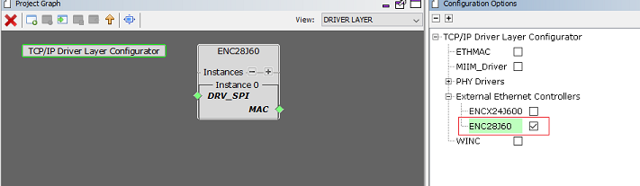

        

    3.  **External ENCX24j600 ethernet driver**

        TCP/IP ENCx24j600 driver module selected for the external ethernet mac ENC28j60 device. For high MAC TX and RX performance DRV\_ENCX24j600\_MAC\_TX\_DESCRIPTORS and DRV\_ENCX24j600\_MAC\_RX\_DESCRIPTORS can be configured respectively more than the default descriptor value size "2".

        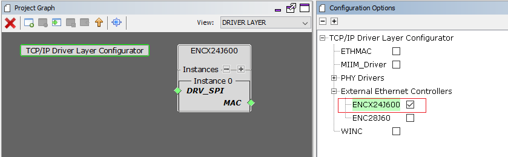

        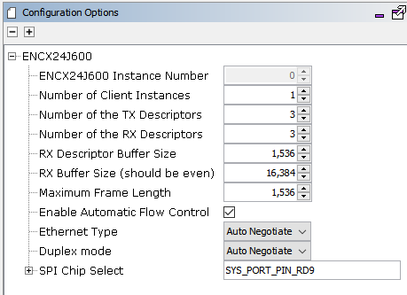

**TCP/IP TCP Client Hardware Configuration**

This is the following section describes the hardware configurations and one of the configuration can be used for this application demonstration.

1.  This section describes the PIC32MX device default hardware configuration use USB device as **on board debugger and programmer** for this application demonstration.

    -   Refer to the PIC32MX Ethernet Starter Kit [User Guide](https://www.microchip.com/DevelopmentTools/ProductDetails/dm320004-2)

        

    -   No hardware related configuration or jumper setting changes are necessary.

    -   Connect the mini USB cable from the computer to the USB DEBUG connector on the PIC32MX Ethernet Starter Kit

    -   Establish a connection between the router/switch with the PIC32MX Ethernet Starter Kit through the RJ45 connector on PHY daughter board

    -   Note: The PIC32MX Ethernet Starter Kit II does not have an on-board UART connector.

        -   If a serial console is needed, a quick workaround may be attaching the Starter Kit to an Explorer 16 Development Board by using a Starter Kit I/O Expansion Board.

        -   Alternatively, a telnet session could be used for console message and TCP/IP command execution.

2.  This section describes PIC32MX device hardware configuration for **external Ethernet controller ENC28J60** with PIC32MX5XX/6XX/7XX development board.

    -   Refer to the ENC28j60 External Ethernet PICtail Plus Daughter Board User Guide

    -   Refer to Starter Kit I/O Expansion Board User Guide

        The 10Mbps Ethernet PICtail Plus Daughter Board is inserted to J2\(or J4\) on the Starter Kit I/O Expansion Board. The J2, PICtail Plus \(SPI\) connector on Ethernet PICtail Plus Daughter Board is attached to I/O Expansion Board. The PICtail daughter board is inserted to use SPI1.

        The PIC32 Ethernet Starter Kit II is connected to J1 on the Starter Kit I/O Expansion board.

        The pins 26 and 47 on J11 \(on I/O Expansion board\) need to be connected to control the Chip-Select line by the PIC32. Note: The PIC32MX Ethernet Starter Kit II does not have an on-board UART connector. If a serial console is needed, Pin 46 \(U2RX\) and Pin 48 \(U2TX\) from connector J11 on I/O expansion board can be used for serial console.

        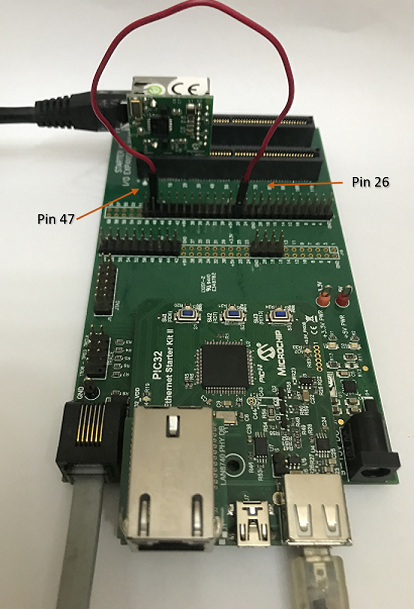

3.  This section describes PIC32MX device hardware configuration for **external Ethernet controller ENC624J600** with PIC32MX5XX/6XX/7XX development board.

    -   Refer to the ENCX24j600 External Ethernet PICtail Plus Daughter Board User Guide

    -   Refer to Starter Kit I/O Expansion Board User Guide

        The Fast 100Mbps Ethernet PICtail Plus Daughter Board is inserted to J2\(or J4\) on the Starter Kit I/O Expansion Board. The J2, PICtail Plus \(SPI\) connector on Fast 100Mbps Ethernet PICtail Plus Daughter Board is attached to I/O Expansion Board with white arrows on the two boards lined up. The PICtail daughter board is inserted to use SPI1.

        The PIC32 Ethernet Starter Kit II is connected to J1 on the Starter Kit I/O Expansion board.

        The pins 26 and 47 on J11 \(on I/O Expansion board\) need to be connected to control the Chip-Select line by the PIC32.

        **Note:** The PIC32MX Ethernet Starter Kit II does not have an on-board UART connector. If a serial console is needed, Pin 46 \(U2RX\) and Pin 48 \(U2TX\) from connector J11 on I/O expansion board can be used for serial console.

        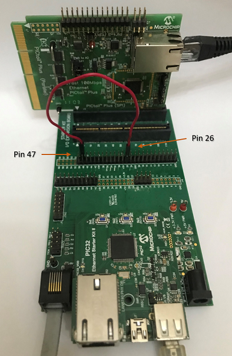

**TCP/IP TCP Client Running Application**

This table list the name and location of the MPLAB X IDE project folder for the demonstration.

|Project Name|Target Device|Target Development Board|Description|
|------------|-------------|------------------------|-----------|
|pic32mx\_eth\_sk2.X|PIC32MX795F512L|PIC32MX Ethernet Starter Kit II|Demonstrates the TCP/IP TCP Client on development board with PIC32MX795F512L device and LAN8740 PHY daughter board. This is a bare-metal \(non-RTOS\) implementation.|
|pic32mx\_eth\_sk2\_freertos.X|PIC32MX795F512L|PIC32MX Ethernet Starter Kit II|Demonstrates the TCP/IP TCP Client on development board with PIC32MX795F512L device and LAN8740 PHY daughter board. This is a **FreeRtos** implementation.|
|pic32mx\_eth\_sk2\_enc28j60.X|PIC32MX795F512L|PIC32MX Starter Kit II + External Ethernet Pictail Controller ENC28j60 + I/O Expansion Board|Demonstrates the TCP/IP TCP Client on development board with PIC32MX795F512L device and external Ethernet controller ENC28J60. This is a bare-metal \(non-RTOS\) implementation|
|pic32mx\_eth\_sk2\_encx24j600.X|PIC32MX795F512L|PIC32MX Starter Kit II + External Ethernet Pictail Controller ENCx24j600 + I/O Expansion Board|Demonstrates the TCP/IP TCP Client on development board with PIC32MX795F512L device and external Ethernet controller ENCx24j600. This is a bare-metal \(non-RTOS\) implementation|

**Running Demonstration Steps**

1.  Build and download the demonstration project on the target board.

2.  If the board has a UART connection:

    1.  A virtual COM port will be detected on the computer, when the USB cable is connected to USB-UART connector.

    2.  Open a standard terminal application on the computer \(like Hyper-terminal or Tera Term\) and configure the virtual COM port.

    3.  Set the serial baud rate to 115200 baud in the terminal application.

    4.  See that the initialization prints on the serial port terminal.

    5.  When the DHCP client is enabled in the demonstration, wait for the DHCP server to assign an IP address for the development board. This will be printed on the serial port terminal.

        -   Alternatively: Use the Announce service or ping to get the IP address of the board.

        -   Run **tcpip\_discoverer.jar** to discover the IPv4 and IPv6 address for the board.

3.  Execution :

    1.  Open the Telnet or UART2 session to get the console output. After the successful broad bring up, the console output for telnet session provides the output. The below diagram shows the UART console output.

        UART2 Output -

        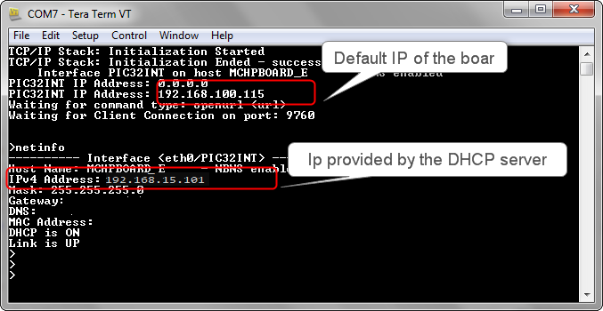

        Telnet Output -

        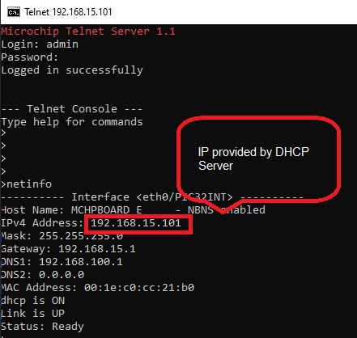

    2.  For TCP Client test, input the following command from the serial port: Open the telnet session with the board IP address

        **openurl < url \>** - The < url \> argument must be a fully formed URL; for instance, http://www.microchip.com/.

        For this above URL , the DNS module will make a DNS query. Then it will open a connection to the requested URL and perform a simple HTTP GET command.

        The response received from the server will be printed on the terminal application through the serial port.

        The expected output -

        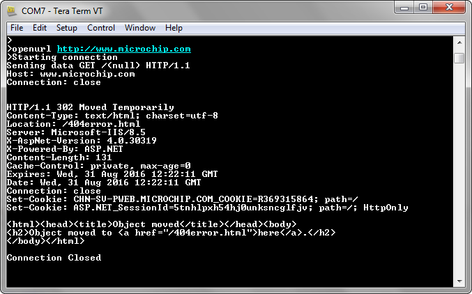

**Parent topic:**[MPLAB® Harmony 3 TCP/IP Application for PIC32MX Family](../../docs/GUID-89F95307-C969-4FDE-A587-CB0E473E603E.md)

